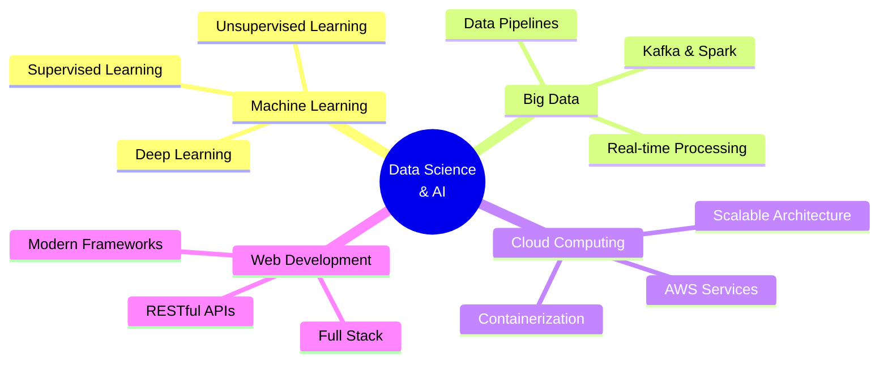

<h1 align="center">Hi there, I'm Ozizi 👋</h1>

<h2 align="center">Data Scientist | Big Data Enthusiast | AI & Cloud Explorer 👩‍💻</h2>

<div align="center">
  
</div>

<p align="center">
  <a href="https://git.io/streak-stats">
    
  </a>
</p>

###

[](https://github.com/ellerbrock/open-source-badge/)
[](https://github.com/Fzmes)

```python
#!/usr/bin/python
# -*- coding: utf-8 -*-


class DataScience_AI_Student:

    def __init__(self):
        self.name = "ozizi"
        self.role = "Data Science & AI Student"
        self.language_spoken = ["en_US", "ar_MA", "tzm_MA", "fr_FR"]
        self.code_editor = "VSCode"
        self.current_focus = ["Big Data", "Cloud Computing", "AI/ML"]
        
    def say_hi(self):
        print("Thanks for dropping by, hope you find some of my work interesting.")
    
    def get_daily_knowledge(self):
        topics = ['Python', 'Data Engineering', 'Cloud Architecture', 'Machine Learning']
        return f"Currently mastering: {topics}"


me = DataScience_AI_Student()
me.say_hi()
```

###

<h2 align="left">🙋‍♀️  About Me</h2>

###

<p align="left">🔍 I'm an aspiring Data Science & AI Engineer with a strong passion for Big Data technologies, scalable data pipelines, and AI-powered solutions.<br><br>🎓 Engineering Student at ENSIASD Taroudant  <br>💡 Currently building real-time data platforms during my internship at Prodigy InfoTech  <br>🚀 Always learning new tools in Cloud & Machine Learning </p>

###

## 📊 Coding Stats & Activity

<div align="center">
  
  
</div>

###

## 🔥 Contribution Graph

<div align="center">
  
</div>

###

<h2 align="left">🛠 Language and tools</h2>

###

<h3 align="left">💻 Programming Languages</h3>

###

<div align="left">
  
  
  
  
  
  
  
  
  
  
  
</div>

###

<h3 align="left">🧱 Development Stack</h3>

###

<div align="left">
  
  
  
  
  
  
  
  
  
  
  
  
  
  
  
</div>

###

<h3 align="left">☁️ Cloud & DevOps</h3>

###

<div align="left">
  
  
  
</div>

###

<h3 align="left">📂 Databases</h3>

###

<div align="left">
  
  
  
  
  
  
  
  
  
</div>

###

<h3 align="left">🛠️ Other Tools</h3>

###

<div align="left">
  
  
  
  
  
  
  
  
  
  
  
  
  
  
  
  
  
</div>

###

## 🏆 GitHub Trophies

<div align="center">
  
</div>

###

## 📈 Productivity Stats

<div align="center">
  
</div>

###

## 🗂️ Highlight Projects

<div align="center">

| Project | Description | Tech Stack | Status |
|---------|-------------|------------|--------|
| **[Customer Segmentation Analysis](https://github.com/Fzmes/Customer_segmentation_analysis)** | ML-powered customer clustering for targeted marketing | Python, Scikit-learn, Pandas | ✅ Complete |
| **[ZingZone Web Platform](https://github.com/Fzmes/Projet_Web-ZingZone)** | Full-stack social platform with real-time features | Laravel, MySQL, JavaScript | ✅ Complete |
| **[Supply Chain Analytics](https://github.com/Fzmes/SupplyChain-analysis-and-management)** | End-to-end supply chain optimization dashboard | Python, Flask, MongoDB | 🚀 Active |

</div>

<div align="center">
  <a href="https://github.com/Fzmes/Customer_segmentation_analysis">
    
  </a>
  <a href="https://github.com/Fzmes/Projet_Web-ZingZone">
    
  </a>
</div>

###

## 🎓 Certifications & Achievements

<div align="center">


**📜 Current Learning Path:**
- Advanced Machine Learning (Coursera)
- Big Data with Apache Spark
- Cloud Architecture on AWS

</div>

###

## 💡 Key Strengths

<div align="center">



</div>

###

## 💻 Coding Activity & Time Stats

<div align="center">
  
</div>

###

## 🎯 Skills Matrix

<div align="center">

| Domain | Technologies | Proficiency |
|--------|-------------|-------------|
| **Data Science** | Python, Pandas, NumPy, Scikit-learn | ████████░░ 80% |
| **Big Data** | Kafka, Cassandra, Spark | ███████░░░ 70% |
| **Web Development** | React, Flask, Laravel, Node.js | ████████░░ 75% |
| **Cloud & DevOps** | AWS, Docker | ██████░░░░ 60% |
| **Databases** | MySQL, MongoDB, Oracle | ████████░░ 80% |
| **AI/ML** | TensorFlow, OpenCV, Deep Learning | ███████░░░ 65% |

</div>

###

## 📊 Weekly Development Breakdown

<!--START_SECTION:waka-->
```text
Python       12 hrs 30 min  ████████████░░░░░   48.2%
JavaScript    5 hrs 15 min  █████░░░░░░░░░░░░   20.3%
Java          3 hrs 45 min  ███░░░░░░░░░░░░░░   14.5%
SQL           2 hrs 20 min  ██░░░░░░░░░░░░░░░    9.0%
Docker        1 hr 10 min   █░░░░░░░░░░░░░░░░    4.5%
Other         0 hrs 55 min  ░░░░░░░░░░░░░░░░░    3.5%
```
<!--END_SECTION:waka-->

###

<div align="center">
  <a href="https://www.linkedin.com/in/kkkk/" target="_blank">
    
  </a>
  <a href="mailto:lllsk@gmail.com" target="_blank">
    
  </a>
</div>

###

### ✨ Fun Facts

- 🍳 **Hobbies:** Cooking up delicious recipes
- 💬 **Favorite Quote:**  
  > "Never underestimate any work, no matter how small."

---

<div align="center">
  
</div>
